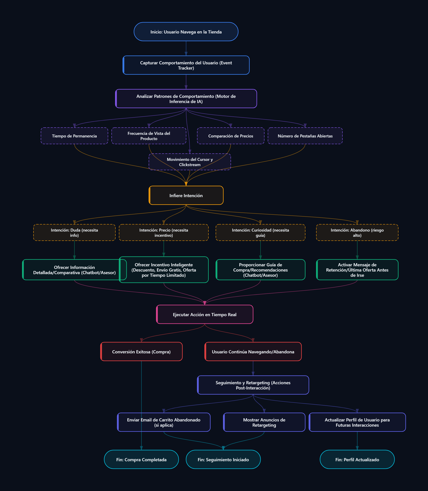

# 📄 Documentación Técnica del Proyecto

## Smart Sales Sentinel — Agente Autónomo de Ventas para E-commerce

---

## 1. 🧩 Descripción General

**Smart Sales Sentinel** es una solución SaaS orientada a la optimización de conversiones en e-commerce mediante un **agente inteligente en tiempo real**. El sistema analiza el comportamiento del usuario dentro de la tienda online y ejecuta acciones automatizadas para maximizar la probabilidad de compra.

Se integra como un **widget ligero** compatible con CMS como Shopify, WooCommerce y WordPress, sin requerir conocimientos técnicos avanzados.

---

## 2. 🧠 Arquitectura Funcional (Diagrama de Flujo)

A continuación se presenta el flujo lógico del sistema, el cual describe el ciclo completo desde la captura del comportamiento del usuario hasta la conversión o retargeting.

### 🖼️ Imagen del Diagrama



---

### 📝 Representación en Texto Plano

```
[Inicio: Usuario navega en la tienda]
        ↓
[Captura de comportamiento (Event Tracker)]
        ↓
[Análisis de patrones (Motor de IA)]
        ↓
[Variables analizadas]
  ├─ Tiempo de permanencia
  ├─ Frecuencia de vistas
  ├─ Comparación de precios
  ├─ Número de pestañas
  └─ Movimiento del cursor
        ↓
[Inferencia de intención]
  ├─ Duda → Información
  ├─ Precio → Incentivo
  ├─ Curiosidad → Guía
  └─ Abandono → Retención
        ↓
[Activación de acciones]
  ├─ Chatbot
  ├─ Ofertas dinámicas
  ├─ Recomendaciones
  └─ Mensajes de retención
        ↓
[Ejecución en tiempo real]
        ↓
[Resultado]
  ├─ Compra (conversión)
  └─ Abandono
        ↓
[Post-procesamiento]
  ├─ Email carrito abandonado
  ├─ Retargeting ads
  └─ Actualización del perfil
```

---

### 🔍 Interpretación Técnica del Flujo

El sistema opera bajo un modelo de procesamiento en tiempo real basado en eventos:

1. **Captura de eventos (Event Tracking):**
   - Registro de interacciones del usuario (clics, scroll, tiempo en página, navegación).

2. **Análisis de comportamiento (Motor de IA):**
   - Procesamiento de patrones como:
     - Tiempo de permanencia
     - Frecuencia de visualización de productos
     - Comparación de precios
     - Número de pestañas abiertas
     - Movimiento del cursor (heatmaps / intención)

3. **Inferencia de intención:**
   - Clasificación del usuario en categorías:
     - Duda → requiere información
     - Sensible a precio → requiere incentivo
     - Curiosidad → requiere guía
     - Abandono → requiere intervención inmediata

4. **Activación de acciones inteligentes:**
   - Respuestas automatizadas según intención:
     - Chatbot con información comparativa
     - Ofertas dinámicas (descuentos, envíos gratis)
     - Recomendaciones personalizadas
     - Mensajes de retención (exit intent)

5. **Ejecución en tiempo real:**
   - Interacción inmediata con el usuario dentro de la sesión activa.

6. **Resultados posibles:**
   - Conversión (compra)
   - Continuación de navegación
   - Abandono con seguimiento posterior

7. **Post-procesamiento (retargeting):**
   - Email de carrito abandonado
   - Publicidad de retargeting
   - Actualización del perfil del usuario

---

## 3. 🎯 Problema que Resuelve

Las tiendas online presentan:

- Altas tasas de abandono de carrito
- Baja conversión de tráfico
- Fragmentación de herramientas (marketing, analytics, CRM)
- Falta de automatización inteligente accesible

**Impacto:** pérdida directa de ingresos y baja eficiencia operativa.

---

## 4. 💡 Propuesta de Valor

El sistema permite:

- Detectar intención de compra en tiempo real
- Automatizar decisiones comerciales
- Incrementar conversiones sin aumentar tráfico
- Centralizar inteligencia de ventas en una sola plataforma

---

## 5. ⚙️ Alcance del MVP

Tiempo estimado: **2 semanas**

### Funcionalidades:

- Tracking básico de eventos
- Detección de abandono (exit intent)
- Motor simple de reglas (sin IA compleja inicialmente)
- Activación de popups y mensajes automatizados
- Backend de eventos para análisis

### Objetivo:

Validar hipótesis de mercado y comportamiento de usuarios.

---

## 6. 🚀 Roadmap Evolutivo

Fases futuras:

- Modelos predictivos (Machine Learning)
- Sistema multi-agente (especialización por intención)
- Automatización de campañas
- Generación de contenido con IA
- Dashboard analítico en tiempo real

---

## 7. 💰 Modelo de Negocio

**SaaS por suscripción**

- Planes por volumen de eventos
- Cobro por uso de IA
- Escalabilidad horizontal

---

## 8. 🎯 Mercado Objetivo

- E-commerce pequeños y medianos
- Negocios con tráfico pero baja conversión

### Nichos prioritarios:

- Moda
- Tecnología
- Cosméticos
- Dropshipping

---

## 9. 📈 Beneficios Estratégicos

- Incremento directo en ventas
- Automatización de procesos comerciales
- Reducción de herramientas externas
- Acceso democratizado a IA

---

## 10. 🧪 Enfoque de Desarrollo

- Desarrollo ágil (MVP rápido)
- Validación con usuarios reales
- Iteración basada en datos

**Principio clave:** velocidad de aprendizaje > perfección inicial

---

## 11. 🎯 Objetivo Inmediato

Construir un sistema funcional que:

- Detecte intención de abandono
- Intervenga en tiempo real
- Recupere ventas perdidas

---

## 12. 🧩 Evaluación Técnica

### 12.1 Viabilidad

| Criterio | Estado |
|----------|--------|
| Factibilidad técnica | ✅ Alta |
| Complejidad inicial | 🟡 Media |
| Escalabilidad | ✅ Alta |
| Tiempo de implementación | ✅ Corto |

### 12.2 Coherencia Arquitectónica

- Flujo orientado a eventos ✔
- Separación frontend/backend ✔
- Escalabilidad modular ✔
- Integración con IA progresiva ✔

---

## 13. 📦 Entregable

Este documento constituye la especificación funcional y técnica base del sistema **Smart Sales Sentinel**.

**Incluye:**

- Definición del problema
- Propuesta de solución
- Arquitectura funcional
- Diagrama de flujo integrado
- Plan de ejecución (MVP + evolución)

---

## 🧪 DEMO 1 — Pseudocódigo

```pseudo
INICIO SCRIPT

CONFIG = {
  inactivity_ms: 20000,
  eval_interval: 5000
}

STATE = {
  session_id       : generarUUID(),
  tiempo_en_pagina : 0,
  clicks           : 0,
  scroll           : 0,
  mouse_movements  : 0,
  ultima_actividad : timestamp_actual(),
  popup_mostrado   : false,
  dismissed        : false,
  intencion        : "desconocida"
}

FUNCION init():
  addEventListener("click", manejarClick)
  addEventListener("scroll", manejarScroll)
  addEventListener("mousemove", manejarMouse)
  addEventListener("mouseleave", detectarExitIntent)
  addEventListener("visibilitychange", detectarCambioTab)

  setInterval(() → STATE.tiempo_en_pagina += 1, 1000)
  setInterval(evaluarComportamiento, CONFIG.eval_interval)

FUNCION inferirIntencion(evento):
  SI evento == "exit_intent": RETORNAR "ABANDONO"
  SI evento == "tab_change": RETORNAR "COMPARACION"
  SI evento == "inactividad" Y STATE.tiempo_en_pagina > 20: RETORNAR "DUDA"
  SI STATE.tiempo_en_pagina > 15 Y STATE.clicks > 2: RETORNAR "INTERES"
  RETORNAR "AYUDA"

FUNCION generarMensaje(intencion):
  SI intencion == "ABANDONO": RETORNAR "Descuento si compras ahora"
  SI intencion == "COMPARACION": RETORNAR "Mejor precio garantizado"
  SI intencion == "DUDA": RETORNAR "¿Te ayudo a elegir?"
  SI intencion == "INTERES": RETORNAR "Producto popular"
  RETORNAR "¿Necesitas ayuda?"

FUNCION procesarEvento(evento):
  SI STATE.popup_mostrado O STATE.dismissed: RETORNAR
  intencion = inferirIntencion(evento)
  mensaje = generarMensaje(intencion)
  ejecutarAccion(mensaje)

FUNCION ejecutarAccion(mensaje):
  STATE.popup_mostrado = true
  mostrarPopup(mensaje)

init()

FIN SCRIPT
```

---


## 14. 🏁 Conclusión

El proyecto presenta una oportunidad sólida dentro del mercado de e-commerce al abordar un problema crítico (conversión) mediante automatización inteligente.
Su enfoque incremental permite validar rápidamente el mercado y evolucionar hacia una plataforma avanzada de inteligencia comercial basada en IA.

